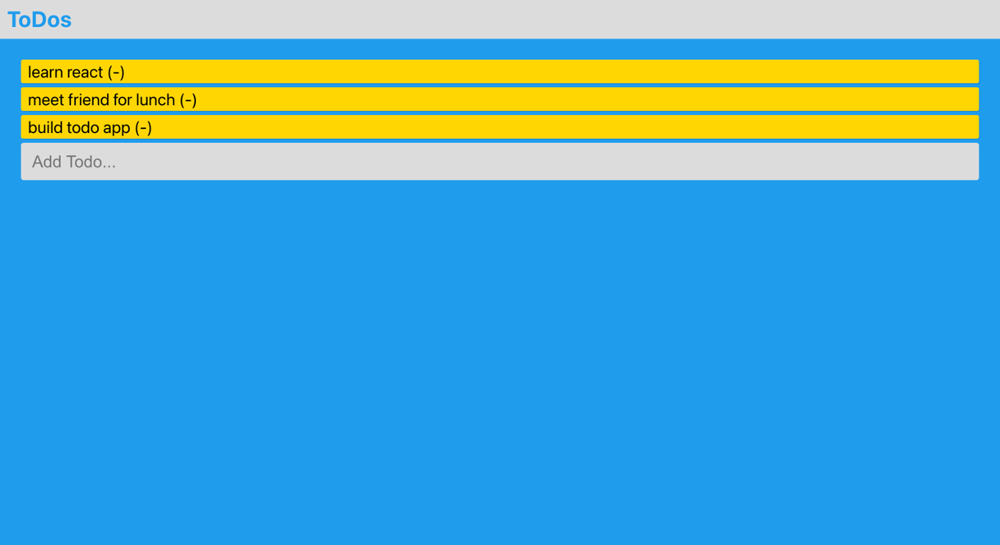

# [To-do-List](https://danilocanuto.github.io/To-do-List/)

In this to do list exercise, the objective was to create an app which uses compoments to refactor the items on a todo list utilizing React.

Future Improvements: Improving on the design using Bootstrap.

Usage: Practice useState/setState/handleSubmit/components/JSX.

Licenced by MIT 'Full Stack Development with MERN program for educational purposes only.
